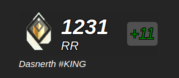

<br>

<p>
 This is an <a href="https://electron.atom.io/">Electron</a> application coded in <a href="https://facebook.github.io/react/">React</a> and utilizes <a href="https://github.com/reactjs/react-router">React Router</a>. It is an open source configurable overlay that can be used on twitch streams for free.
</p>

<br>

## Install

Installation is as simple as downloading the install wizard from the <a href='https://github.com/IBlakeI/valorantoverlay/releases'>releases</a> tab.

## Dev Env

<b>THIS ENV IS INTEDED FOR LINUX: <a href='https://releases.ubuntu.com/focal/'>Ubuntu 20.04.6 LTS (Focal Fossa)</a></b> <br>

Development can be made on Windows, but these setup steps are for linux.

Clone the repo:

```bash
git clone https://github.com/IBlakeI/valorantoverlay.git
cd valorantoverlay
```

You can run the `install script` to make sure your environment is ready:

```bash
cd scripts
sudo ./create_dev_env.sh
```

Install npm if you don't have it already:

```bash
curl -o- https://raw.githubusercontent.com/nvm-sh/nvm/v0.39.5/install.sh | bash
```

Then install the npm dependencies:

```bash
source ~/.bashrc
nvm install 19.0.0
nvm use 19.0.0
npm install
```

## Starting Development

Start the app in the `dev` environment:

```bash
npm start
```

## Packaging for Production

To package apps for the local platform:

```bash
npm run package
```

## Maintainer

- [Blake](https://github.com/iblakei)
