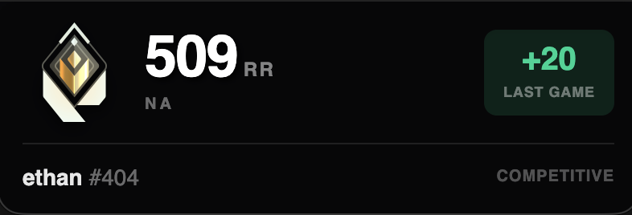
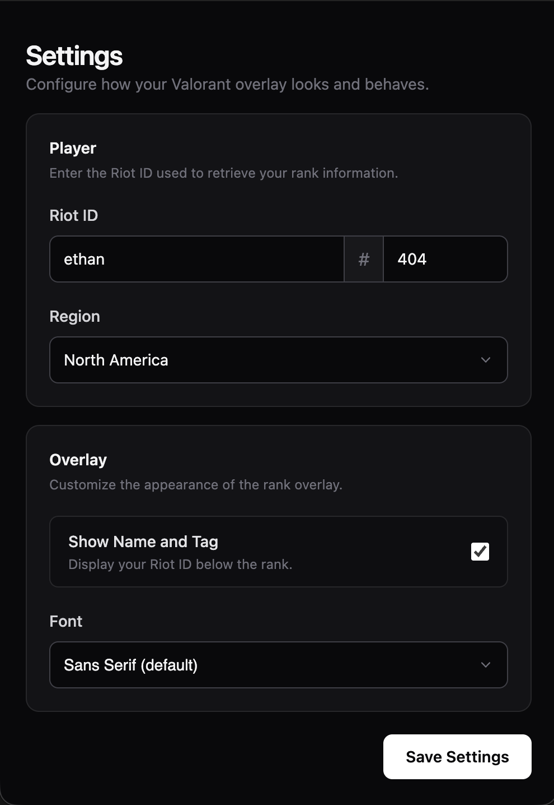

# valorant-overlay

An Electron application with React and TypeScript

## Recommended IDE Setup

- [VSCode](https://code.visualstudio.com/) + [ESLint](https://marketplace.visualstudio.com/items?itemName=dbaeumer.vscode-eslint) + [Prettier](https://marketplace.visualstudio.com/items?itemName=esbenp.prettier-vscode)

## Project Setup

### Install

```bash
$ pnpm install
```

### Development

```bash
$ pnpm dev
```

### API Key

You need to generate an api key [here](https://api.henrikdev.xyz/dashboard/).

1. Login through discord (you can use a throw-away account if you want)
2. Click `API Keys`
3. Click `Create First Key`
4. Set a name, description, and leave the access tier as "Standard"
5. Generate the key and copy it
6. Run `cp .env-example .env` on the command line from the root of the repo
7. Open the .env file and past in your key after the "="

### Configuring the Overlay

You can set your username and tag and customize the look of the overlay in the settings menu. This can be opened from the menu bar at the top of your screen.





### Build

```bash
# For windows
$ pnpm build:win

# For macOS
$ pnpm build:mac

# For Linux
$ pnpm build:linux
```
